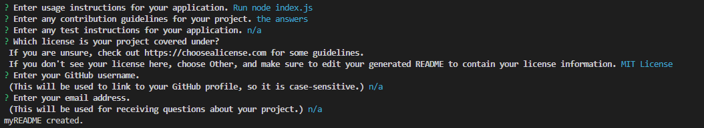

# 09 Node.js Challenge: Professional README Generator

## Description

This application was created as a homework assignment for the University of Richmond coding boot camp. The task was to implement a README generator based on instructions left as comments in two incomplete JavaScript files. While working on this project, I was able to put into practice a lot of the information I have learned in class about Node.js, which helped me gain a much better understanding of how Node works.

## Usage

You will be prompted to enter information that you want to include in your README, section by section. I recommend typing out some of the longer responses, such as your project description or usage instructions, in a text editor first and copy-pasting it into the command line. I will provide below a list of prompts so that you can write your responses out ahead of time if you wish. See sampleREADME.md for an idea of how the finished product will look.

• Enter the title of your project.
• Enter a description of your project.
• Enter any installation instructions for your application.
• Enter usage instructions for your application.
• Enter any contribution guidelines for your project.
• Enter any test instructions for your application.
• Which license is your project covered under? If you are unsure, check out https://choosealicense.com for some guidelines. If you don't see your license here, choose Other, and make sure to edit your generated README to contain your license information.
• Enter your GitHub username. (This will be used to link to your GitHub profile, so it is case-sensitive.)
• Enter your email address. (This will be used for receiving questions about your project.)

If everything has worked correctly, you should see a notice in the terminal that myREADME has been created. The README that is generated from your input will be named myREADME.md so as not to accidentally replace this README in the project files. The file will be located in the same directory as the index.js file for this application. You are welcome to rename the file and make any other edits you see fit to make when you move it to your project. If you don't move the file out of the directory it is generated in, the next README you generate will overwrite that file.

## Video Link
https://drive.google.com/file/d/1VECBHYaHlHVbL8N0uUrGt0WkHpFgQYzm/view?usp=sharing

## Screenshots

## Questions

Find me on GitHub: [aneripatel2002](https://github.com/aneripatel2002)

